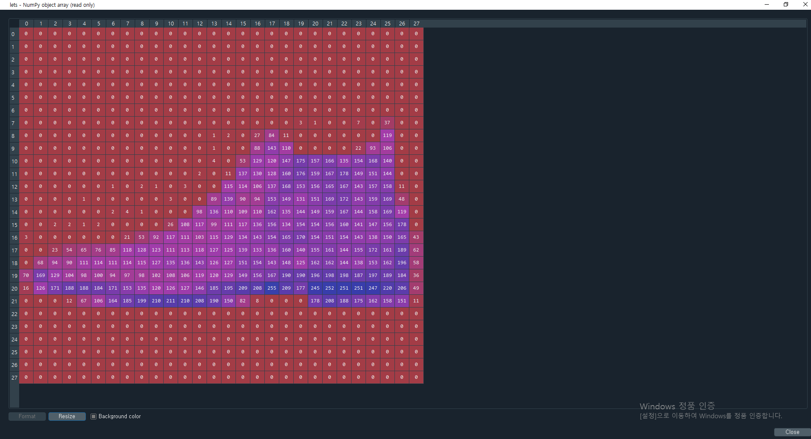
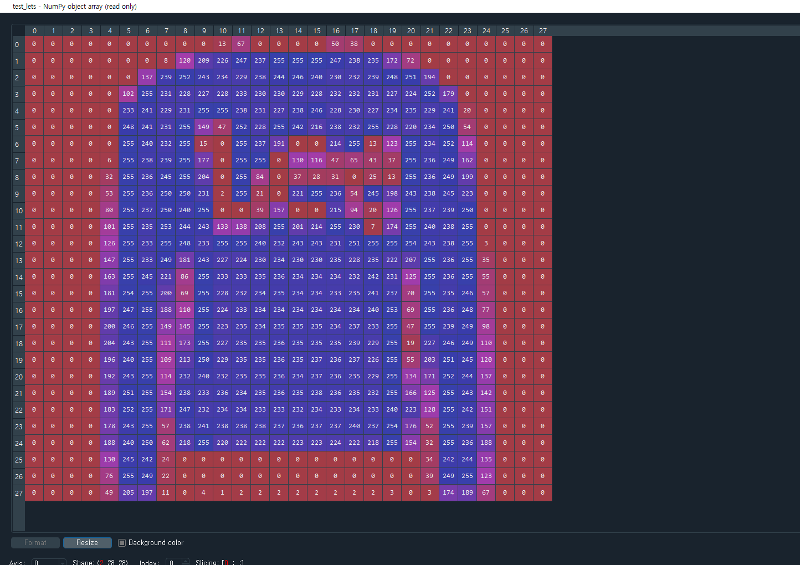
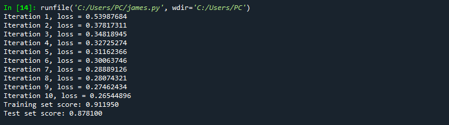
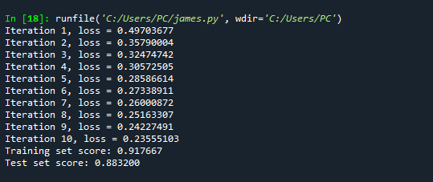

## 👨week3  
-  Assignment 3-1: Fashion MNIST 사이킷런 MLP 모델을 통해서 Fashion-MNIST 분류를 하는 모델을 구현함
-  Assignment 3-2: sckit-learn’s digits
### 🙄의문점?
- [How to choose the number of hidden layers and nodes in a feedforward neural network?
](https://stats.stackexchange.com/questions/181/how-to-choose-the-number-of-hidden-layers-and-nodes-in-a-feedforward-neural-netw)


-------
## Fashion MNIST Data

### In code 

```python

#Keras library makes it easy to use Fashion MNIST datasets.

fashion_mnist = keras.datasets.fashion_mnist
(train_images, train_labels), (test_images, test_labels) = fashion_mnist.load_data()

'''
dataset info  @EunchanLee

train_images = (60000,28,28) 60000 images of 28x28
test_images  = (10000,28,28) 10000 images of 28x28

train_labels = (60000,)      60000 label values of 1D array   
test_labels  = (10000,)      10000 label values of 1D array   


label 

0 ~ 9 exists

0 = T-shirt/top 1 = Trouser 
2 = Pullover    3 = Dress
4 = Coat        5 = Sandal
6 = Shirt       7 = Sneaker
8 = Bag         9 = Ankle boot
'''

```

### Sample Data  

**Label = 9(Ankle boot)**



**Label = 2(Pullover)**  
    



--------


## 🐷 Hidden layer 최적의 개수 찾기


|Rank#|HiddenLayer Size|Traning Score|Test Score|
|----|----|----|-----|
|⭐1|784|0.919183|0.885600|
|⭐2|3136|0.917667|0.883200|
|⭐3|100|0.911950|0.878100|
|4|256|0.911900|0.877300|
|5|128|0.911367|0.875700|
|6|50|0.903200|0.866500|
|7|25|0.876283|0.853200|
|8|32|0.873917|0.848900|

- TRY1 : Size 50


- TRY2 : Size 100


- TRY3 : Size 25


- TRY4 : Size 128


- TRY5 : Size 784


- TRY6 : Size 3136


- TRY7 : Size 32


😅Google's pick, but..  

 
 
- TRY8 : Size 256


