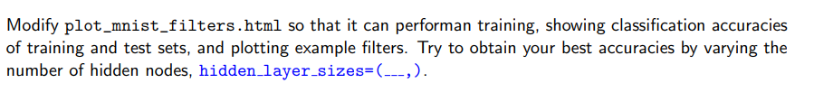
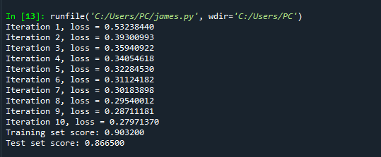
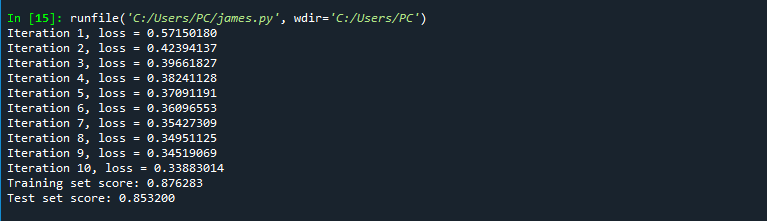
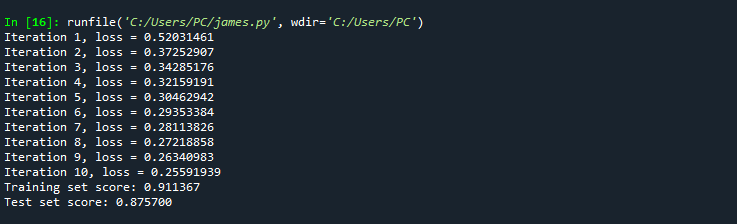
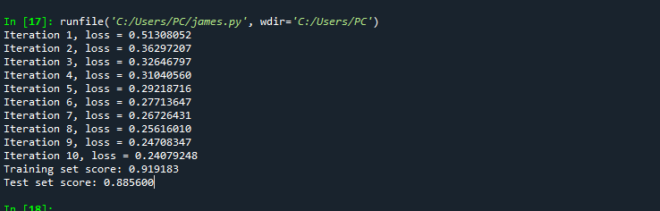
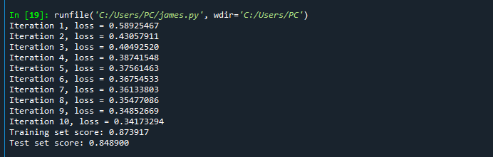
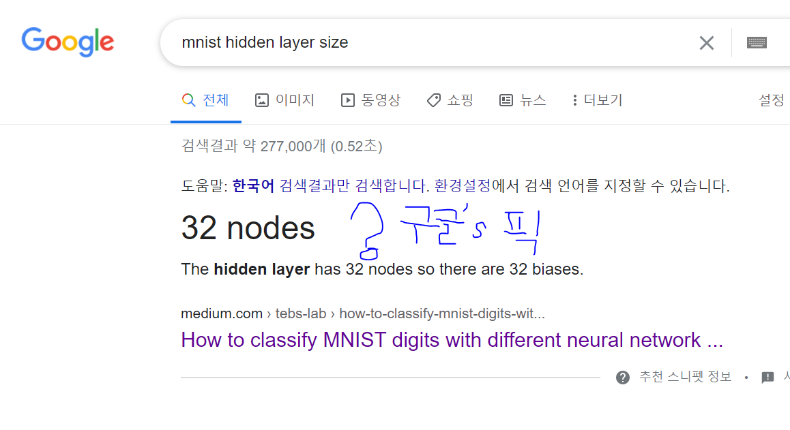
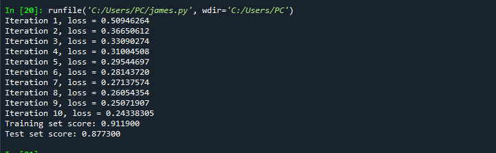

## week 3 Homework 
- hw1 사이킷런 MLP 모델을 통해서 Fashion-MNIST 분류를 하는 모델을 구현함

### 🙄의문점?
- Hidden Layer의 Size는 어떻게 정하는게 맞는가?-> 휴리스틱?..

-------

### 🐷 Let's find the best number of Hidden layer size!

- TRY1 : Size 50

- TRY2 : Size 100

- TRY3 : Size 25

- TRY4 : Size 128

- TRY5 : Size 784

- TRY6 : Size 3136

- TRY7 : Size 32

**😅Google's pick, but..**
 
- TRY8 : Size 256

