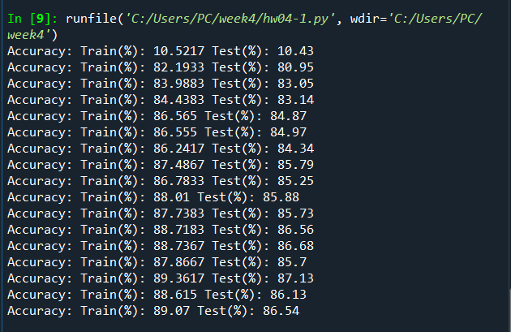

# Week 4. 신경망 학습 on Fashion-MNIST & Digits-data & wine.csv

## 🖥File info
```(python)
main.py = example code
hw4-1.py = HW4-1 for Fashion-MNIST
hw4-2.py = HW4-2 for Digits in Scikit-learn
hw4-3.py = HW4-3 for Wine.csv


```

---


## HW info

- data 총 3개
  - 1,2는 지난 주와 데이터 동일함
  - 3은 wine.csv 
- 예제 코드도 있어서 쉽게 할 수 있음


## TwoLayerNet model

- 오차역전파법을 적용한 2층 신경망 클래스	
- 5.7.2 오차역전파법을 적용한 신경망 구현하기	181page


## Dataset 1. Fashion-MNIST

**신경망 모델 예측 성능 Accuracy**  


▶86~87%대 Test Accuracy 보임 !  




--------


## Dataset 2. Digits data from Scikit-learn


▶96%대 Test Accuracy 보임 !  

정확도 상승 원인: Fashion-MNIST에 비해 비교적 적은 데이터 size


--------


## Dataset 3. Wine.csv


--------


