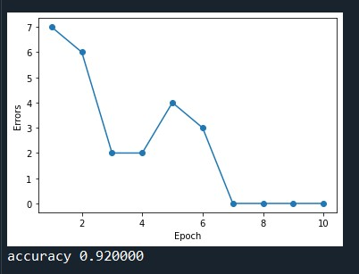
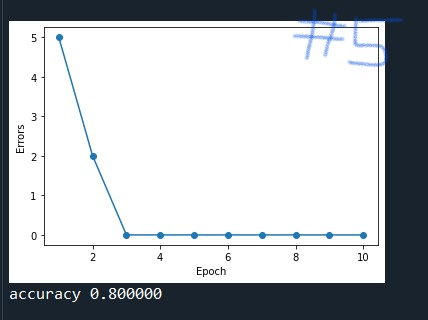

## 👨 week2

- epoch이 커짐에 따라 Error가 감소하는 것을 그래프로 확인
- 그리고 그에 따른 각 예제별 Accuracy value 

## 😒의문점?

- 똑같은 코드 구조 속에서 hw02-5의 accuracy는 왜 상대적으로 낮은가? : Data의 문제?
- 3,4차원 이상의 데이터는 plot이 불가능한가?

### hw02-1.py

### hw02-2.py

### hw02-3.py

### hw02-4.py

### hw02-5.py

